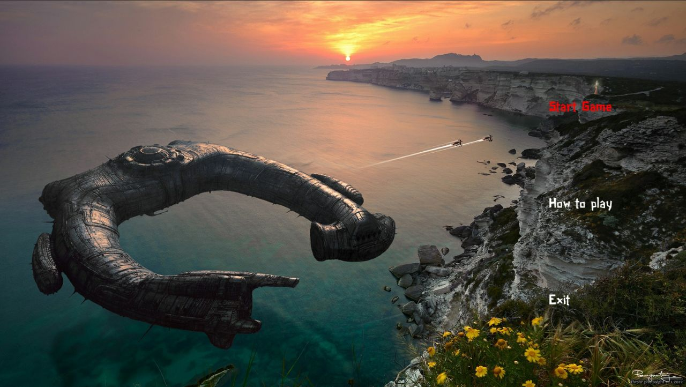
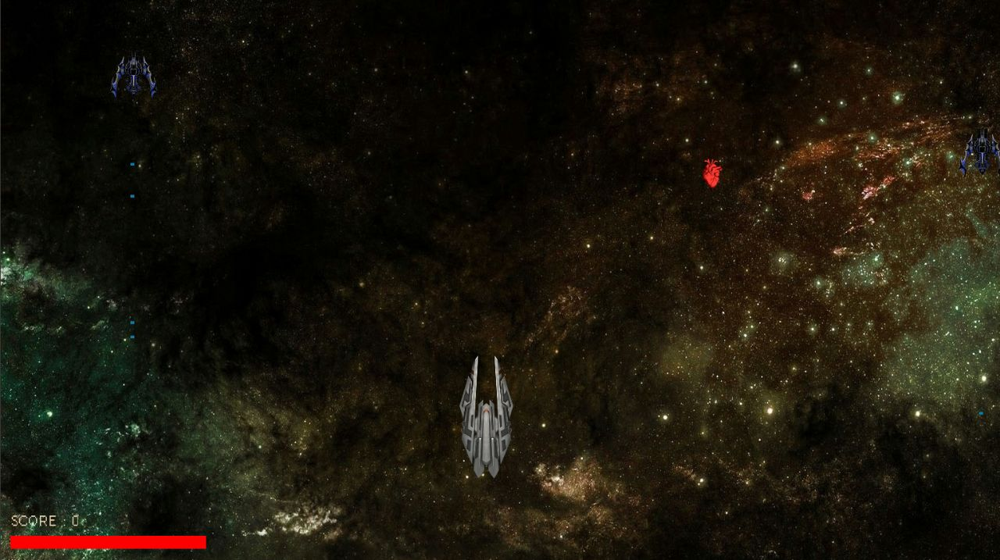

# 🚀 SFML Arcade Shooter

A classic **2D space shooter game** built with **C++** and **SFML**.  
You control a spaceship, fight waves of enemies, collect hearts and shields, and defeat the boss to win the game.  

---

## 🎮 Features
- 🛸 Player spaceship with smooth movement and shooting mechanics  
- 👾 Multiple enemy types with different behaviors  
- 💀 Boss fight with unique attack patterns  
- ❤️ Collectible hearts (extra lives)  
- 🛡️ Collectible shields for temporary protection  
- 🎨 Pixel-art style graphics & retro fonts  
- 🎵 Background music and sound effects  
- 📜 Start menu and in-game HUD  

---

## 🖼️ Screenshots
<p align="center">
  
  
</p>

---

## ⚙️ Requirements
- **C++17 or newer**  
- [SFML 2.5+](https://www.sfml-dev.org/download.php) (Graphics, Audio, System, Window)  

---

## 🔧 Installation & Run
1. Clone the repository:
   ```bash
   git clone https://github.com/MoveZZZZ/SFML-project-C.git
   cd SFML-project-C-main
   ```
2. Make sure SFML is installed on your system.  
   On Ubuntu:
   ```bash
   sudo apt-get install libsfml-dev
   ```
3. Compile the project:
   ```bash
   g++ src/*.cpp -Iinclude -o game -lsfml-graphics -lsfml-window -lsfml-system -lsfml-audio
   ```
4. Run the game:
   ```bash
   ./game
   ```

---

## 🕹️ Controls
- **Arrow Keys / WASD** → Move  
- **Space** → Shoot  
- **ESC** → Pause / Exit  

---

## 📂 Project Structure
```
SFML-project-C-main/
│── src/           # Source code (.cpp files)
│── include/       # Header files (.h)
│── Images/        # Sprites & backgrounds
│── Font/          # Game fonts
│── main.cpp       # Entry point
```

---

## 🛠️ Development
- Language: **C++**  
- Framework: **SFML**  
- Paradigm: **OOP** (classes for Player, Enemy, Boss, Items, etc.)  

---

